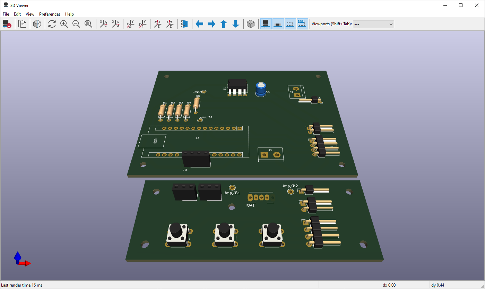
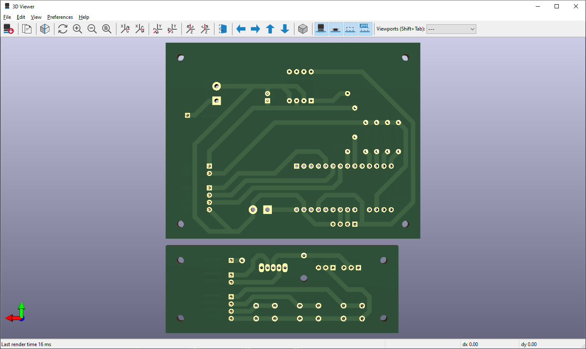
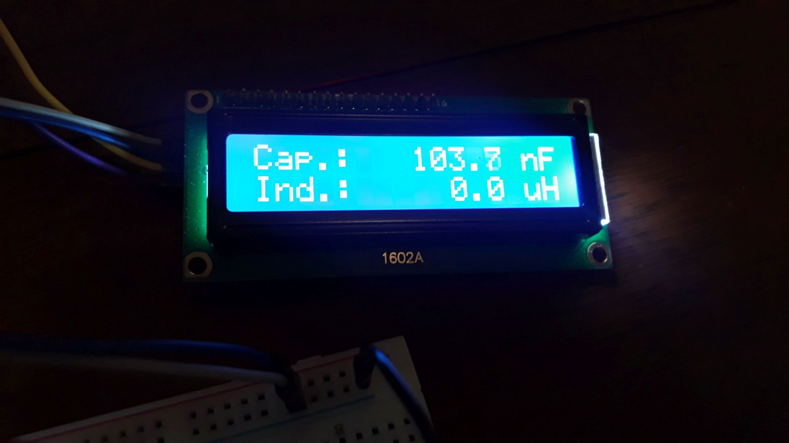

# LC Meter v2.0

A Capacimeter + Inductometer based on Arduino Nano.  
Capacitor measurement with 3 working modes: accuracy (slow), balanced and speed.

This proyect was inspired on video [Medidor de Bobinas/Inductores y Capacitores con Arduino y Display LCD](https://www.youtube.com/watch?v=hMa-AWyuxaA) (spanish) from [Electgpl](https://www.youtube.com/@electgpl) YouTube channel.

Coming soon: Case 3D model  :-)

&nbsp;

This project use the following electronic components:
- 1 x Arduino Nano v3.0
- 1 x LCD Display 16x2
- 1 x LCD Display I2C Module
- 1 x LM358 Operational Amplifier
- 1 x Capacitor 1uF
- 1 x Switch Button (2 positions)
- 3 x Push Button
- 1 x 220 ohm resistor
- 1 x 470 ohm resistor
- 1 x 10K ohm resistor
- 1 x 100K ohm resistor
- 1 x 1M ohm resistor
- 14 x pin-header 90 degress
- 2 x Bornier x2 (optional)
- 1 x DC conector (optional power 5-12V)
- 2 x Alligator clip conector (optional external measurement)
- wires

&nbsp;

### Screenshots

| Diagram - Schematics                            | Diagram - PCB                                   |
|-------------------------------------------------|-------------------------------------------------|
|          |                |

| Diagram - PCB Render                            | Diagram - PCB Render                            |
|-------------------------------------------------|-------------------------------------------------|
|      |       |

| Prototype                                       | Prototype                                       |
|-------------------------------------------------|-------------------------------------------------|
|                  |                  |

| PCB Manufacturing                               | Project Assembly                                |
|-------------------------------------------------|-------------------------------------------------|
|          |               |

| PCB Assembly                                    | PCB Assembly                                    |
|-------------------------------------------------|-------------------------------------------------|
|               |               |

| Case 3D model                                   | Project Final                                   |
|-------------------------------------------------|-------------------------------------------------|
|              |              |

See 'Rescources' sub-folder for more pictures & videos of the project.

&nbsp;

### Version History

v1.0 (2024.03.02) - Initial release.  
v1.1 (2024.03.03) - Adding case 3D model.

&nbsp;

This source code is licensed under GPL v3.0  
Please send me your feedback about this project: andres.garcia.alves@gmail.com
